Programming the SLG47910 FPGA On XYZ Board 
###########################################

Our XYZ Board Features Reneasas Forge FPGA SLG47910 1K Luts FPGA.The datasheet for which can be found `here <https://www.renesas.com/en/products/programmable-mixed-signal-asic-ip-products/forgefpga-low-density-fpgas/slg47910-1k-lut-forgefpga>`_ 

Renesas GO Configure Software Hub is Used to programme the FPGA .

Note: This is a very comprehensive Guide to getting started we recommend going throught these documents for a better understanding.

1. `Forge FPGA SLG47910 Datasheet <https://www.renesas.com/en/document/dst/slg47910-datasheet?r=25546631>`_ 
2. `Go Configure Forge FPGA Workshop <https://www.renesas.com/en/document/gde/forgefpga-workshop-user-guide?r=25546631>`_
3. `Software Simulation Guide <https://www.renesas.com/en/document/mas/forgefpga-software-simulation-user-guide?r=25546631>`_

Installation 
-------------

The Reneasas Go Configure Software hub is a Free to use software however one need to create a account on Reneasas website to Downloding it. 

*Follow these Steps to Install the Software on Your PC.*

**STEP 1:**  Follow this `Link <https://www.renesas.com/en/software-tool/go-configure-software-hub>`_ to the software downlode Page.

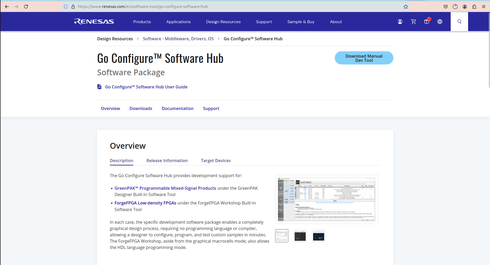

**STEP 2:**  Register a new user on the Renesas Website.

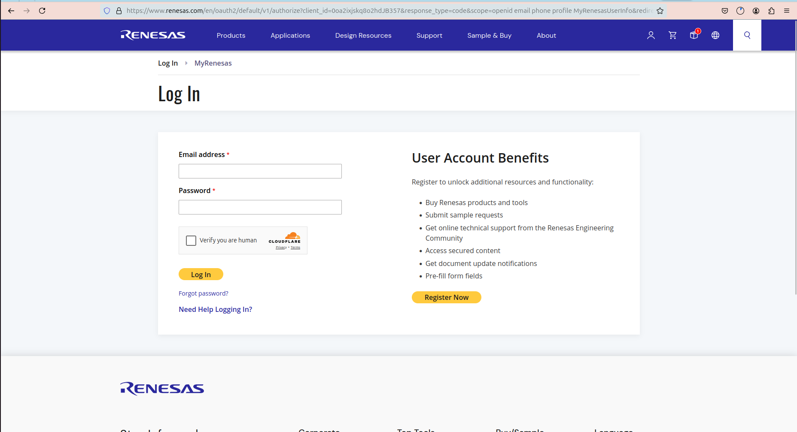
 
Onces you log in it will take you to the home page of renesas Follow this `Link <https://www.renesas.com/en/software-tool/go-configure-software-hub>`_ again to go the software downlode page.

**STEP 3:**  Now Click downlode the software accroding to your OS. And install it Installation is very easy similar to any other software on the OS.

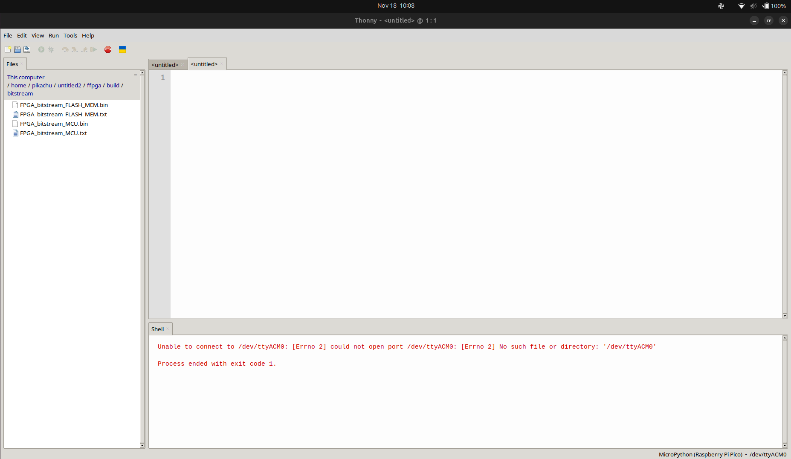

If you have succesfully installed the Software its time to move to usage guide.

Usage
-----------

Now that you have succesfully installed the IDE let try to create a project with it. 

*We will follow these steps to Create a simple led Blink Project on the FPGA Side of the Board.*

**STEP 1:** Lauch the Go Configure IDE 

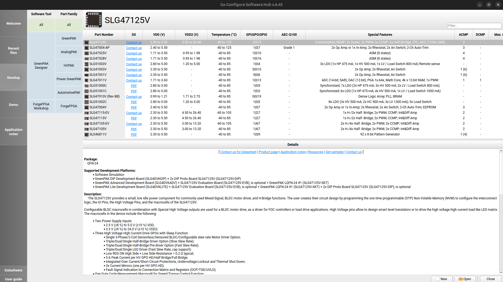

**STEP 2:** Move to Develop Tab and open Forge FPGA Workshop Now Double Click on the SLG47910 part in the Menu.

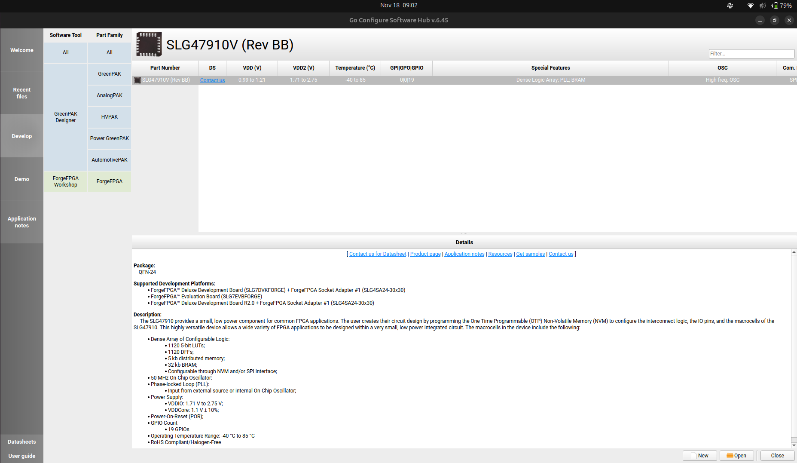

**STEP 3:** Now Select the project name and project location of your choice.

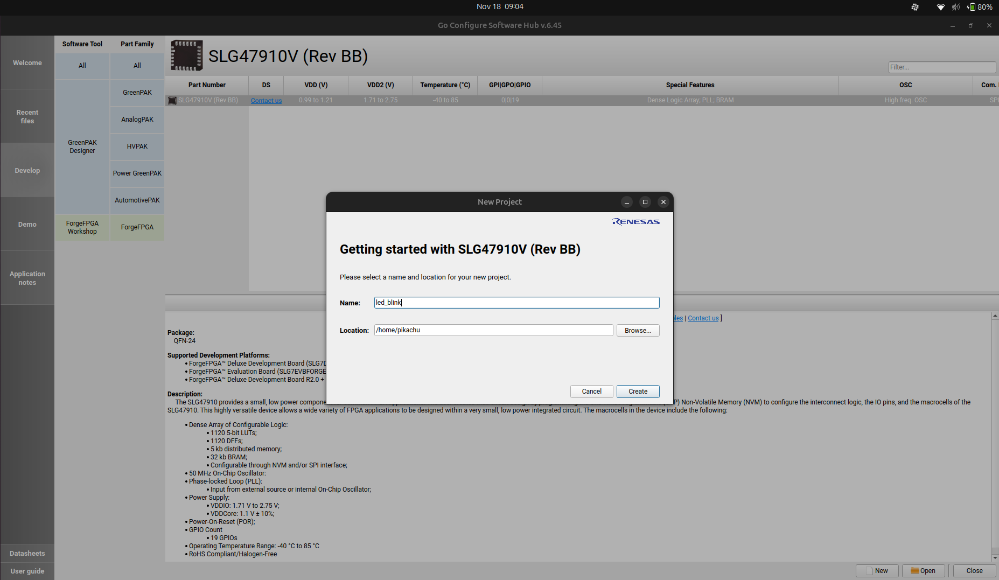

**STEP 4:**  Onecs you have selected the name and project location you will se the proejct setting tab selected the project settings as mentioned in the Image below.

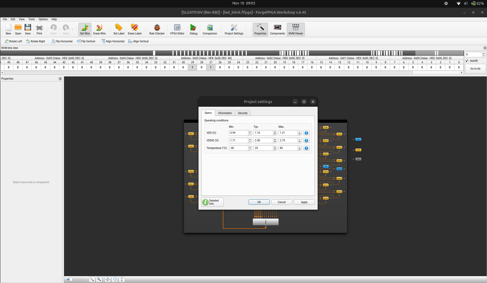

**STEP 5:**  After addeding the project settings double click on the project setting in the IDE and you should move to a new tab with a main.v file open. This is you main editor.

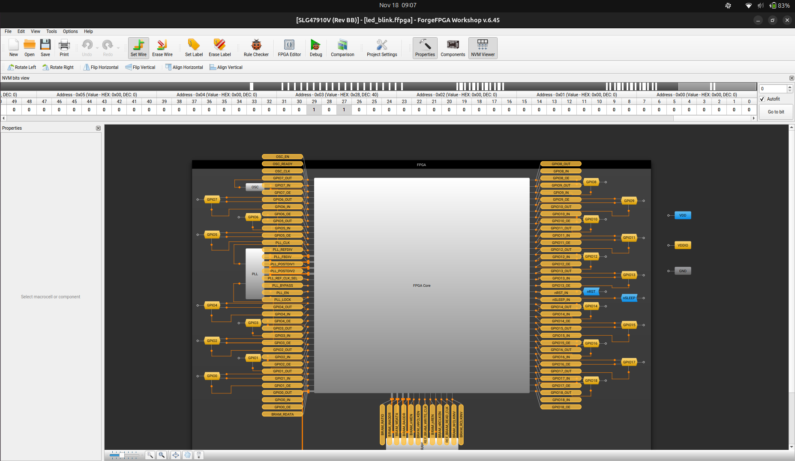

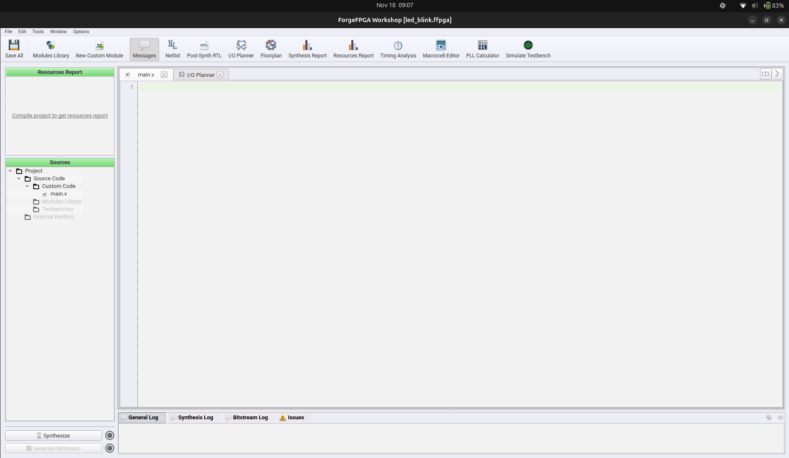

**STEP 6:**  Quick Look at the IDE 
The Go Configure Software Hub is a Complete FPGA Work Flow IDE that handles Project from Design Entry to the FPGA Flashing.

THe few main feature are .

**STEP 7:**  Design Entry We will now write the verilog for blinking the on board Led connected to the FPGAon our XYZ Board. 

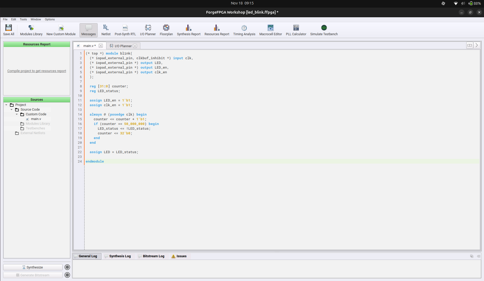

Here the link Verilog for the Design . Our you can write your custome Led Blink example as well.

There a Few primitive that we would have to take care of while writing Design in our  IDE Unlike other FPGA IDE teh GO COnfigure Software Hub Require us to mention the top module in the verilog itself with a primitive (* top ) , the clock input requires to be defined with primitive (* iopad_external_pin, clkbuf_inhibit*) .

A complete Guide to Design Entry in Go Configure Software hub is linked here It is quite necessary for you to go through this after finish this tutorial for now you can continue with our Verilog 

**STEP 8:**  Simulation The GO configure Software Hub Usage Iverilog with GTKWave for the task of 
Simulation. These Software could be downloded from here. 

**STEP 9:** Design Synthesis: After Simulation onces the design is working as expected we would need to Synthsys the Design. 
To Synthsyse the Design One need to Press the Synthsize Button in the Buttom Left Corner of the IDE. If your Design get Synthesized Properly you should see a green tick in from front of the Synthsize Button.Otherwise you can check Synthesis Log or Issues tab for error.

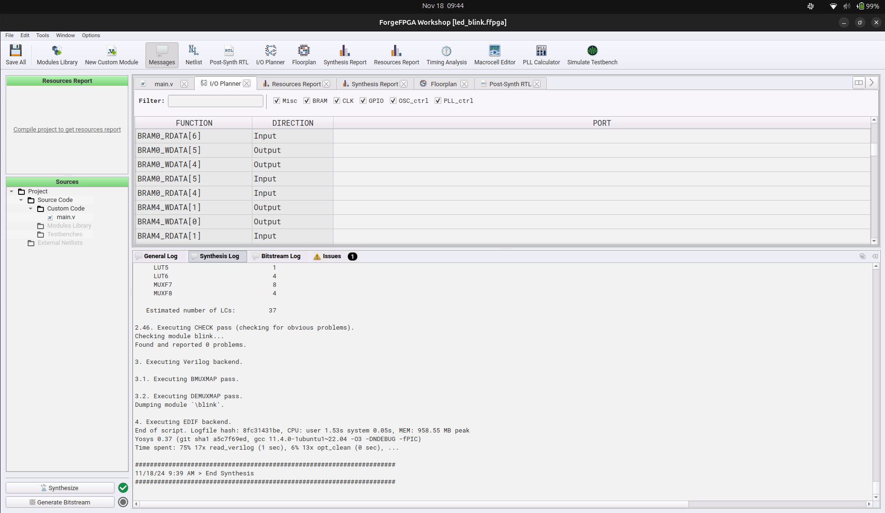

**STEP 10:**  IO Planning : Onces your Design is Synthesized Properly we need to map our I/O Port to the FPGA I/O . The GO Configure Software Hub Has a simple GUI based IO planner. One need to link the IO port 
to respeted pin. 

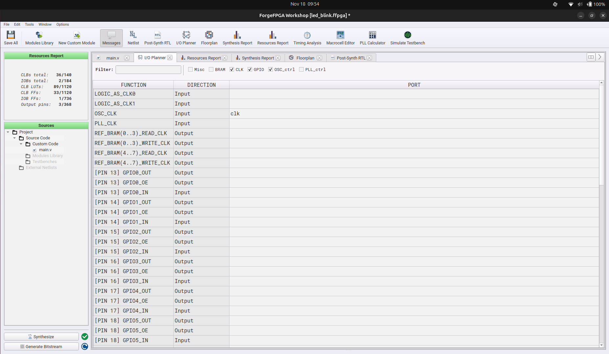

In our case our led is connected to the Physical pin 18 of FPGA IC so we will Link it to that and we will connecte the Clock to the Osc output and we will also connected enable pin for both. 

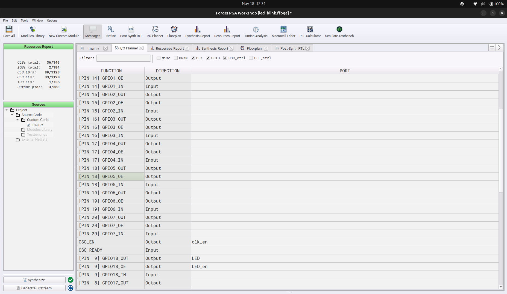

**STEP 11:**  Bitsream Generation : The Next step in the flow is Bitsream Genration. Onces your IO are mapped Properly you are just one step away from the Bitsream Genration and this button is available just below the Synthsize Button onces pressed a automated flow will start which will do all Placemenent , Routing and Bitstrem
Generation. If the Bitstream is genrated Properly you will see a Green tick in front of GenerateBitsream Button.

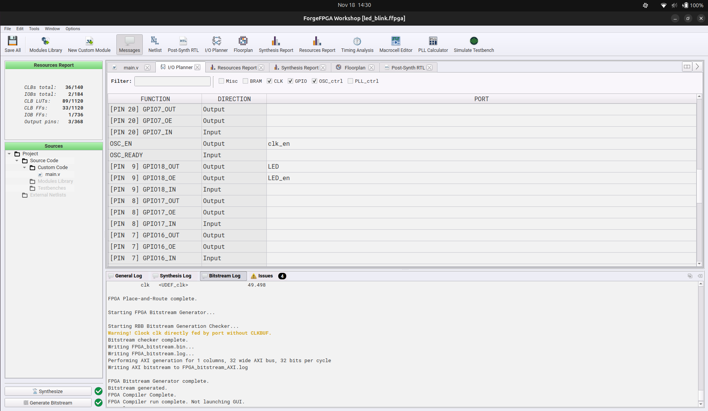

Now that your Bitsream is genrated properly we have to flash the FPGA with it. 

-----------------------
FLASHING THE Bitsream :
-----------------------

So You have succesfully genrated the Bitsream for you project Very Good. Now we have to Flash or write that Bitsream to
FPGA (we will continue with the Led_blink example) and we are using RP2040 as a SPI Master to do it. And we have a custome script for it. 

Before moving along with the Flashing part you wold have to setup the MCU (RP2040) Programming Part of the XYZ Board a Guide for that can be found here If You have done it we can move to flashing 

One Need to flow these Step to Flash the Bitsream to FPGA. 

**STEP 1:**  Connect the Board to your Host PC and move to Thonny IDE in Thonny Enable VIEW < Files. 

Now in this view the flies on the uper left side of manager are your host files and the lower left side
are files availble on your RP2040 and flash. 

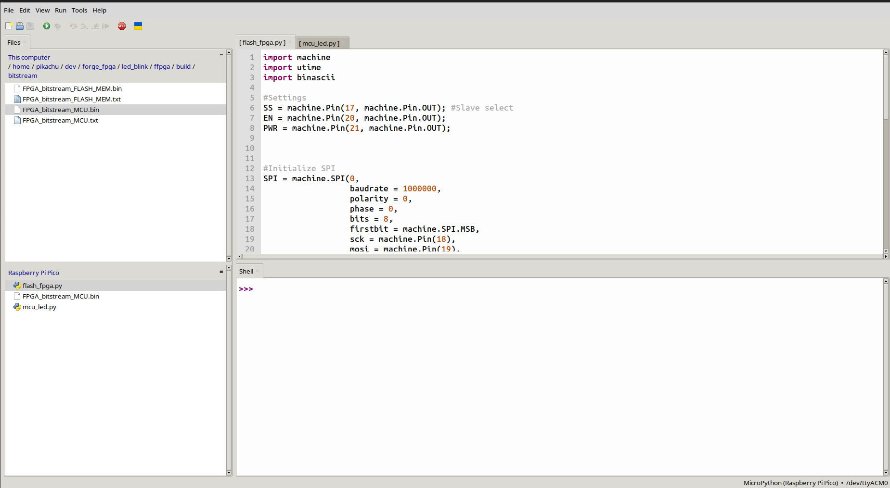

**STEP 2:** Getting the Bitsream On RP2040 : To flash the bitsream to the FPGA you first need to get the bitsream on to the on board flash. To do so navigate to you project folder in hte view tab of Thonny on in the project 
older move to ffpga/build/bitstream . Here you should see 4 diffrent bitsream available we only need FPGA_bitstrem_MCU.bin file on out RP2040 Now Right click on the file and click uplode. This will uplode your file the RP2040 

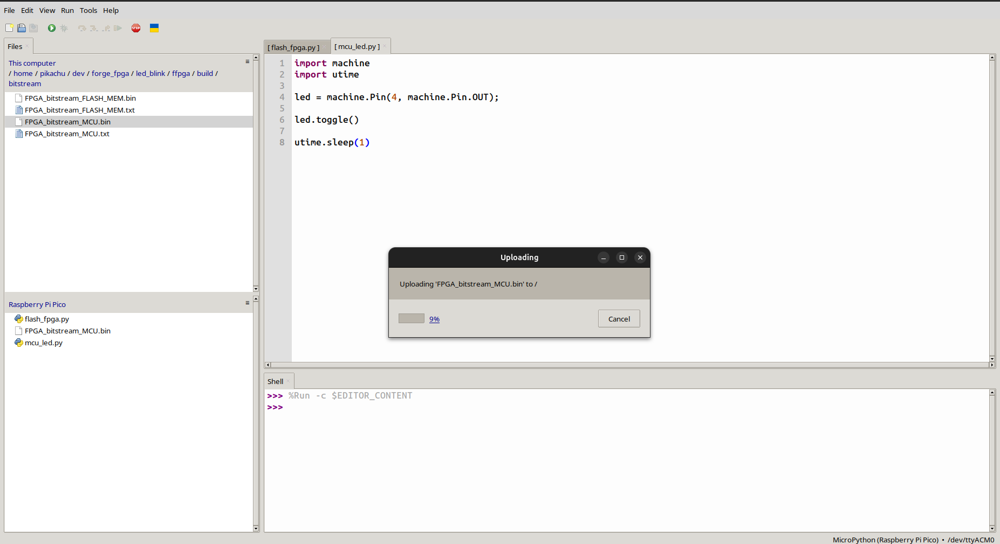

**STEP 4:**  Now as you have got the Bitsream on the FPGA we just need to flash for that you need to run flash_fpga.py script 
available on you XYZ Board you can also find it HERE. Open the pyhton script and run it . You should se hte terminal output 
FPGA Flashed onces the Flashing is done.  And you should see on Board LED blinking. 

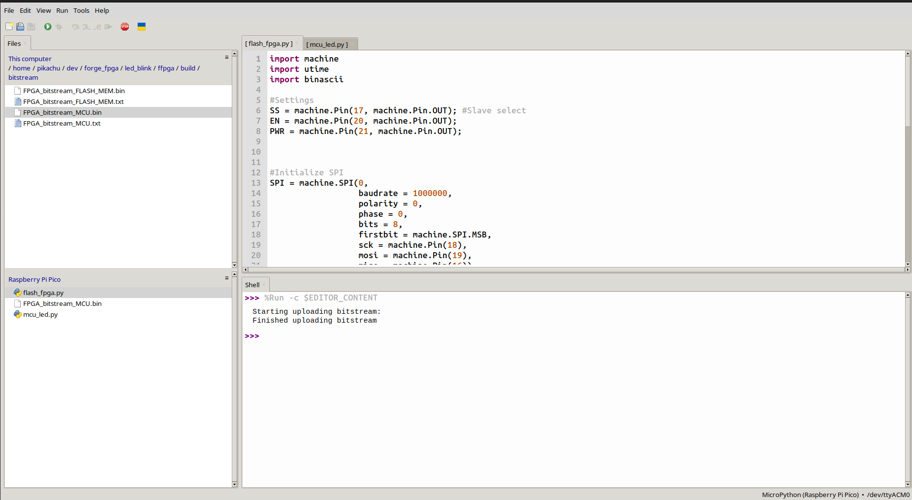

One should follow the same step to flash any other bitsream as well. 

Thank You 

Yours
Deepak Sharda 

Vicharak Computers 

