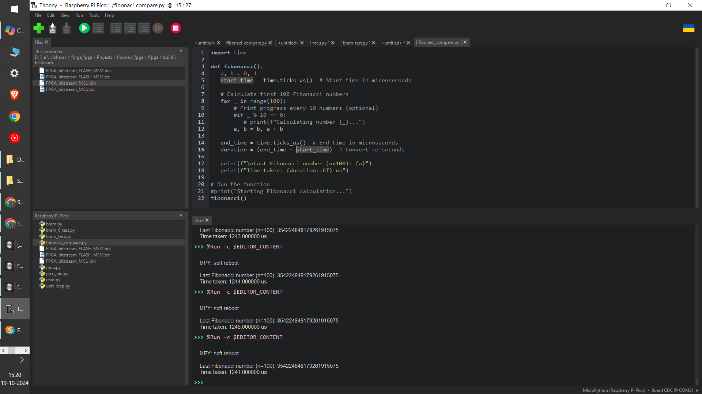

# Comparing the computing time of RP2040 to the FORGE FPGA SLG47910

In the project We have tried to compare the computing of FPGA with The RP2040 MCU. The Compute is to calculate the first 100 elements of the Fibonacci Sequence .
The nature of this task in sequential it will iterate a for loop 100 times.

The Project could be found here [Fibonaci_FPGA](../Projects/fibonaci_fpga) 

This test is consist of two part: 

    1. MicroPython Programme for RP2040.
    2. FPGA Project to be Exicuted on SLG47910 Forge FPGA.

### Run Time Comparison Table 
   | Platform    | Time Taken |  Frequency |
   | ----------- | -----------| -----------|
   | RP2040      | 1241 us    | 125 MHz     |
   | FPGA        | 3.7 us     | 50 MHz     |

 ### LA Output for the FPGA Implmentation 

 .png>)

 ### Terminal OutPut for RP2040 

 
