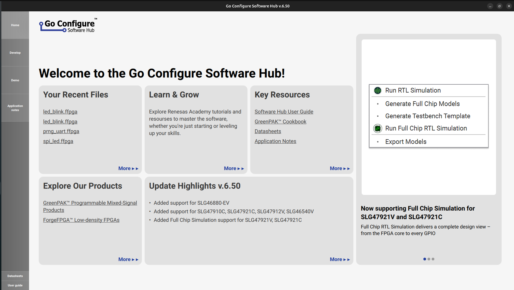
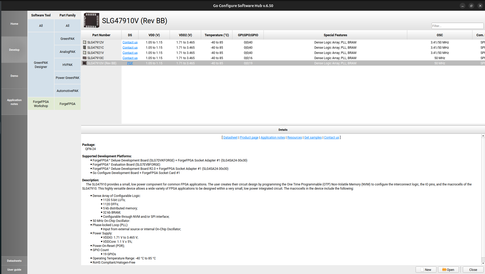
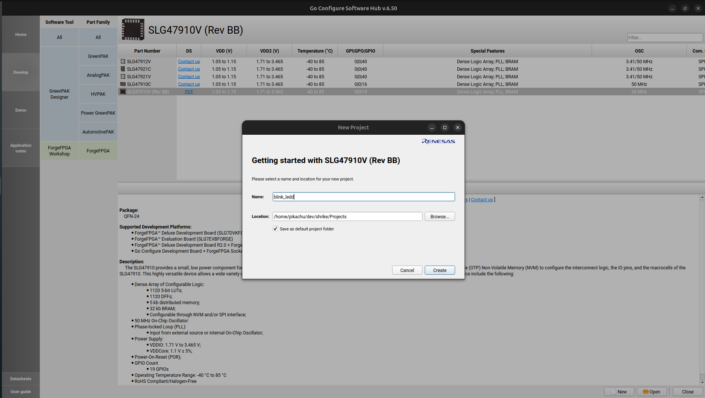
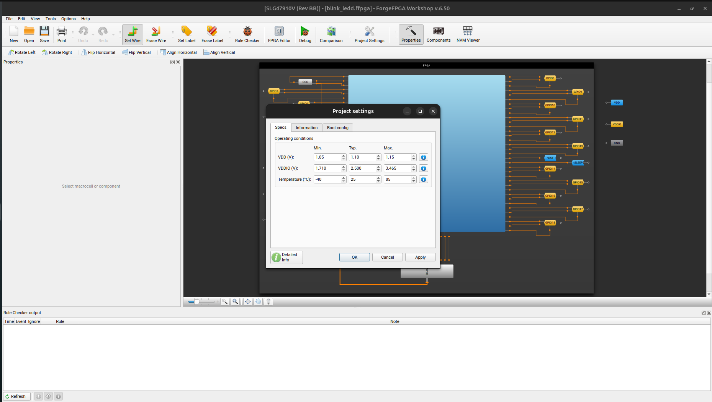
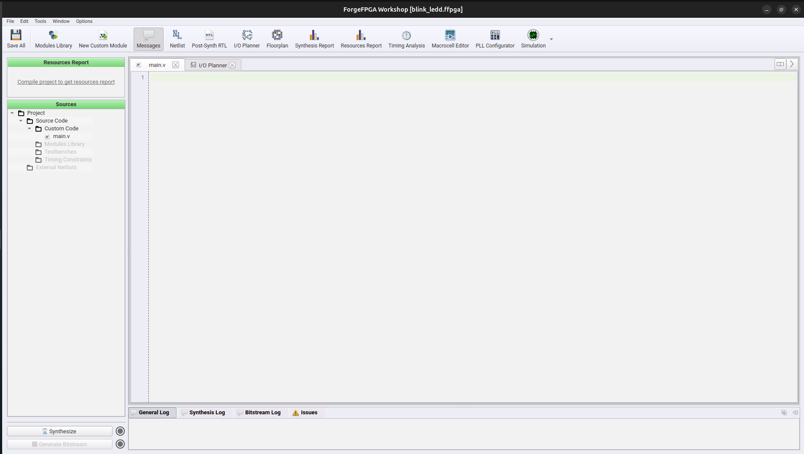
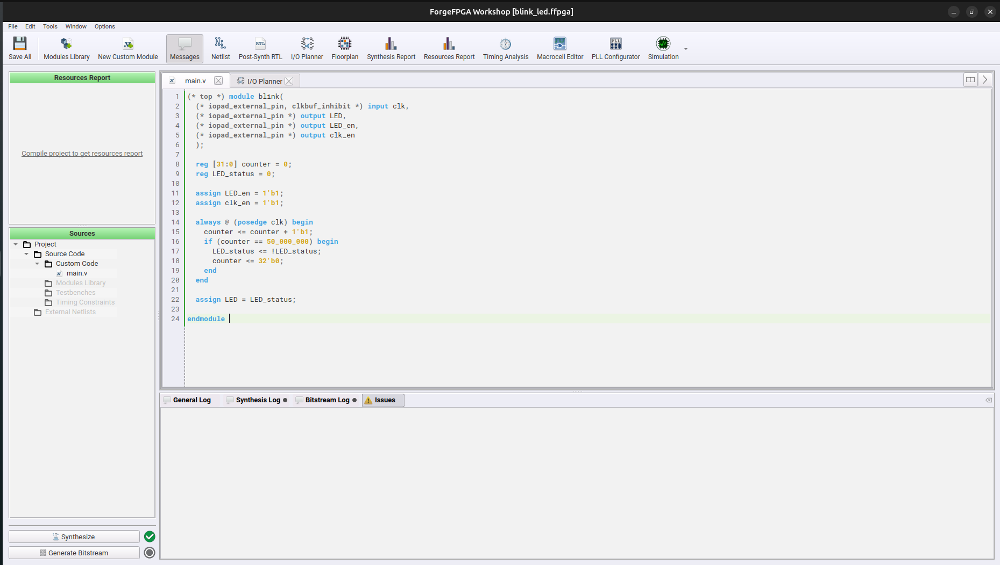
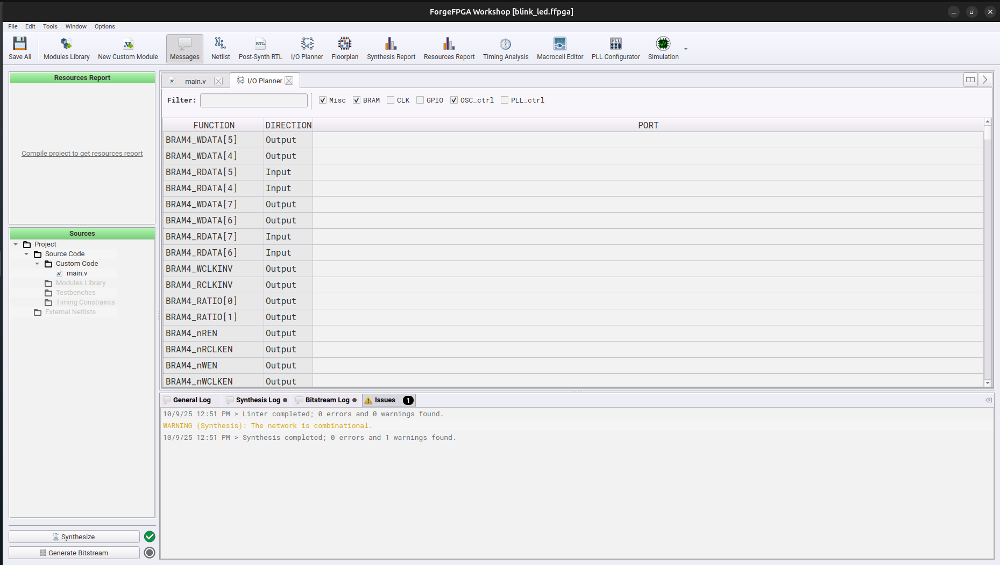
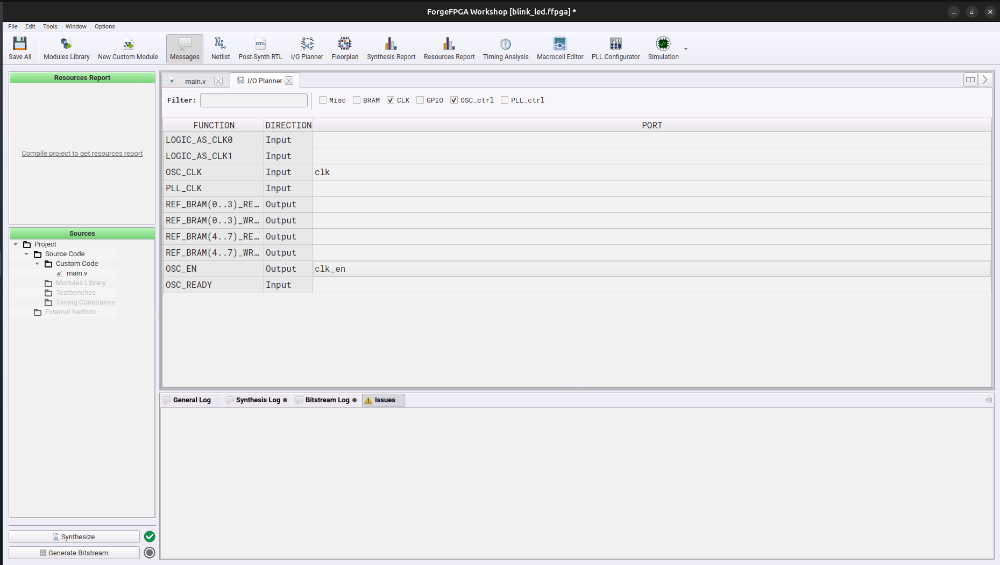
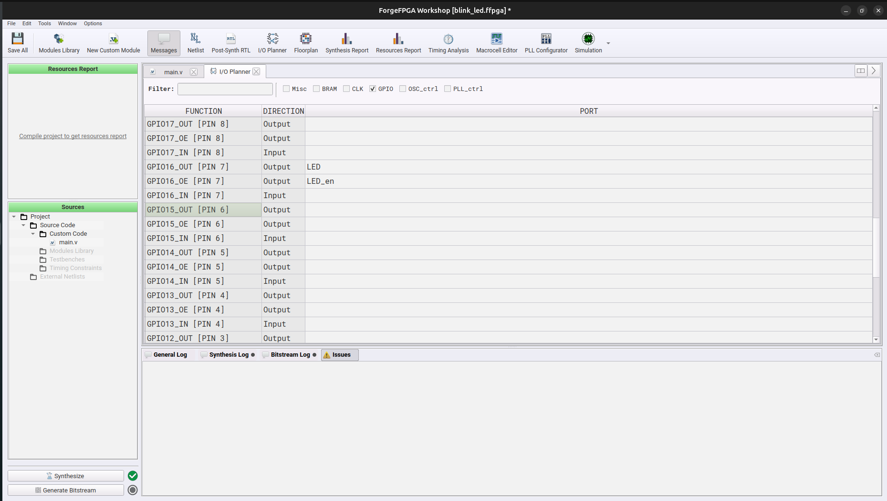
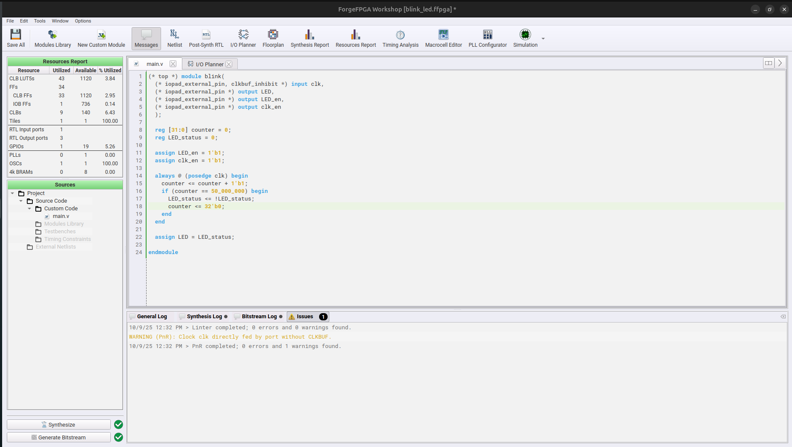

# Shrike Bitstream Generation Guide 

Bitstream is a firmware that is used to programme the FPGA and map our design to it. Shrike uses a Renesas Forge FPGA SLGV SLG47910 1K Luts FPGA.The datasheet for which can be found [here](https://www.renesas.com/en/products/slg47910) .


For generating the bitstream for shrike we will use these steps. 

  1. Setup 
  2. Design & Synthesis 
  3. IO Mapping and Placement and Routing (PNR)

I am here assuming that you have installed all the tools required if not check tools_setup_guide [HERE](./tools_setup_guide.md).

We will create a LED Blinking Project for this guide and we will start by launching the Go Configure Software Hub.  

### 1. Setup  

1. Launch the GO Configure Software Hub and move to the Forge FPGA tab under the Develop Tab. 

<div align="center">

 

</div>

2. Double click on the FPGA ( ) in our case.
NOTE: You can also just open the led blink project available in the Projects section of github that can be one from the open option in hte bottom right corner and then navigate the the ffpga file of that project. 

<div align="center">

 

</div>

3. Now select the project name and project location of your choice. 

<div align="center">

 

</div>

4. Now you will see the window Project setting select the first values in each box by clicking the arrow beside it.
It should look like this.

<div align="center">

 

</div>

5. Double click on hte light blue square (FPGA COre) in and you should see this window.  Now you are done with setup lets design our blink led hardware.    

<div align="center">

 

</div>


Check out this short video guide. 


<div align="center">

  <video width="90%" controls>
    <source src="./images/bitstream_gen/go_config_launch.webm" type="video/webm">
    Your browser does not support the video tag.
  </video>

</div>

### 2. Design 

Now we will how we design the led_blink hardware that is Verilog for the design. 

So as of now we are aware that we need a led that should be blinked so lets declare that in verilog. 

```
module led_blink (output led,
                  output led_en);
endmodule
```

Now every output requires a output enable for forge FPGA thus we will define a led_en pin as well and we will keep it high ( value = 1) by default so that led signal ( IO) is always a output from the board.

We need to figure out a way to so how are we going to blink ( toggle ) this led for convience lets assume we want to blink it every second . So this tell's us that we need some kind of clock to check the time and how much time has passed. 

We have a clock on out FPGA its a a pulsating that creates a 50Mhz square wave we have to use this to calculate to one second to do so we can simply add a counter that counts till 50_000_000 cycles as that how much we will require to reach one second at a 50 Mhz frequency. 

Thus now we will create a hardware that blinks a led whenever its counter reaches 50_000_000 and the verilog for this will look like this 


```
(* top *) module blink(
  (* iopad_external_pin, clkbuf_inhibit *) input clk,
  (* iopad_external_pin *) output LED,
  (* iopad_external_pin *) output LED_en,
  (* iopad_external_pin *) output clk_en
  );

  reg [31:0] counter;
  reg LED_status;

  assign LED_en = 1'b1;
  assign clk_en = 1'b1;
  
  always @ (posedge clk) begin
    counter <= counter + 1'b1;
    if (counter == 50_000_000) begin
      LED_status <= !LED_status;
      counter <= 32'b0;
    end
  end

  assign LED = LED_status;

endmodule 

```


There are a lot other ways to blink an led as well and you can always use those however before writing verilog for shrike please checkout [Style Guide](./verilog_style_guide.md) for reference .

However here we are assuming that you are using the code mentioned above . Get this code in the main.v in the software.

<div align="center">

 

</div>

Now the next step will be to synthesize the verilog for doing so click the button in the bottom left corner. It should take a minute and then you will a green tick beside it that should tell you that synthesis has happens without any error. 


Now we will move to IO planning and bitstream generation. 

### 3. IO Planning and PNR 

Now that we have synthesized hte verilog lets connect the signal to the Input outputs pins. Follow the command below to map hte required pins.

 1. Open the IO planner from the top bar in hte software.

<div align="center">

 

</div>

 2. Now we will first map we will map the clock pins filter the selection by using CLK and OSC_ctrl tab.

 We have two clock related signal "clk" and "clk_en" map them to "OSC_CLK" and "OSC_EN" respectively.

<div align="center">

 

</div>
 

 3. Led map the led out signals filter the selection using only he GPIO uptick all the other onces. 
 We have two signal related to led "LED" and "LED_en" as out on board led is connected to pin number 16 we will connected these signals to "GPIO16_OUT"  and "GPIO16_OE" respectively.

<div align="center">

 

</div>

 4. IO planning has been done save the setting and press Generate Bitstream button in the left bottom . It will take some time to generate bitstream and you will see a green tick after its done. 

<div align="center">

 

</div>

 Congratulation's you have generated your first hardware. 


<div align="center">

  <video width="90%" controls>
    <source src="./images/bitstream_gen/complete_flow.webm" type="video/webm">
    Your browser does not support the video tag.
  </video>

</div>


Now that you have generated your first bitstream let's upload these on the FPGA these will be pretty simple follow the step 3-4 step in the guide or complete guide if you checking it for first time [getting_started](./getting_started.md) . 


I will also recommend you to go through hte the docs available [here](https://www.renesas.com/en/products/slg47910).