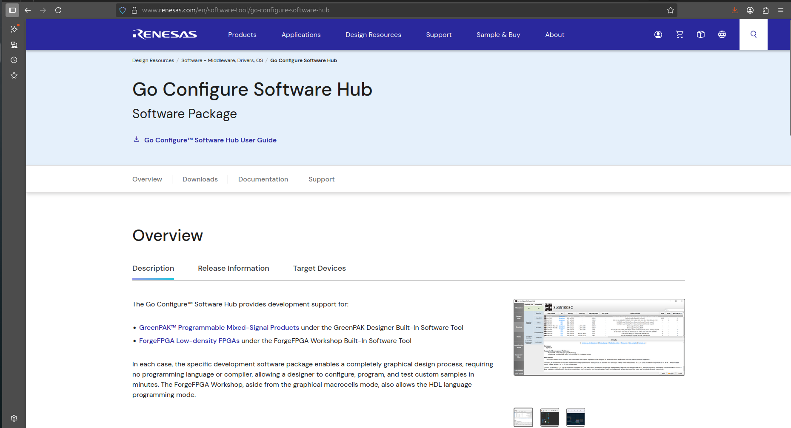
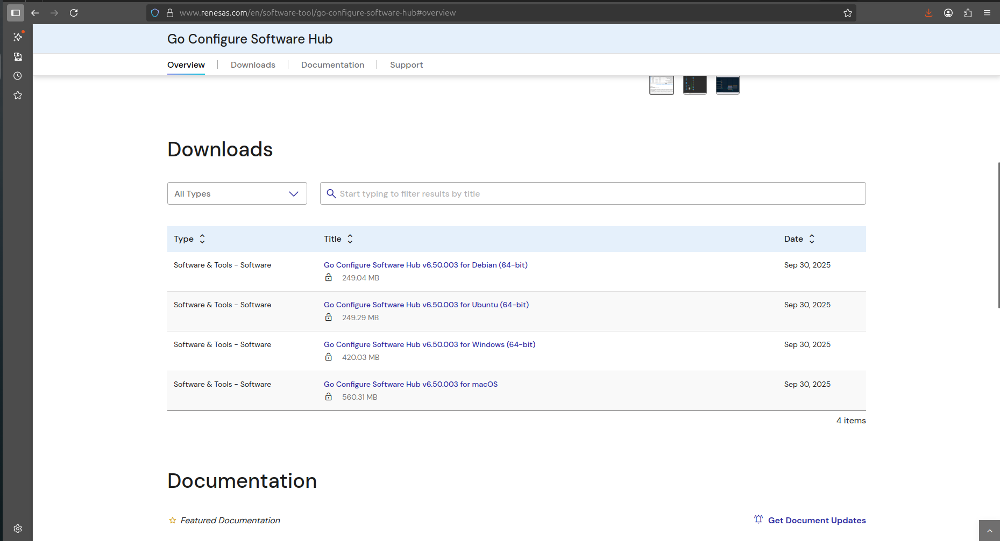
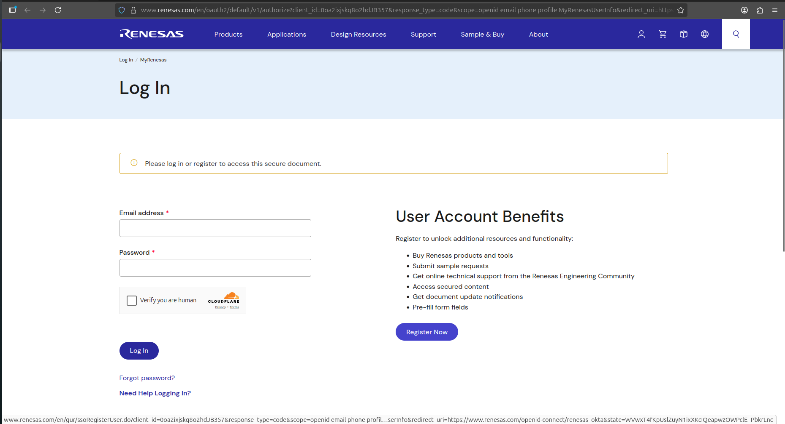
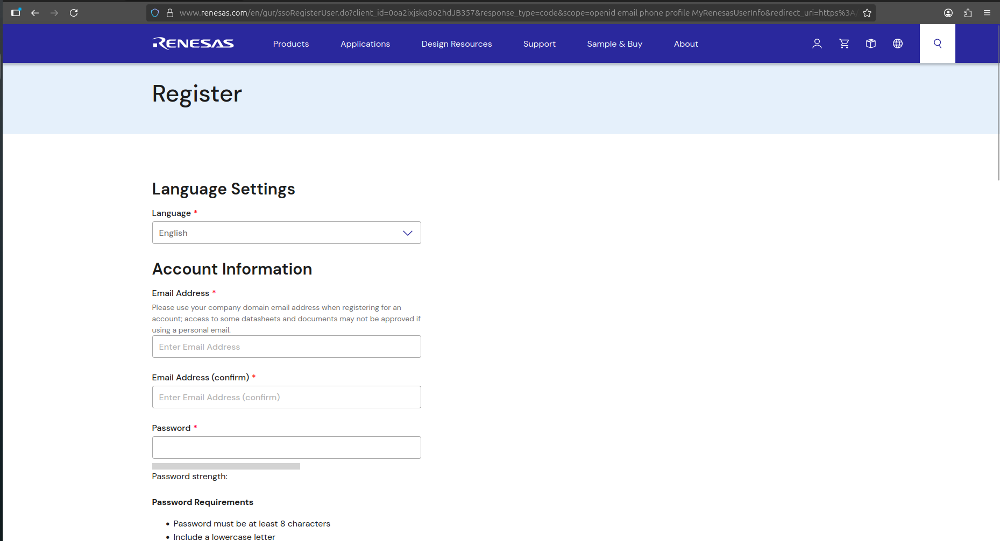
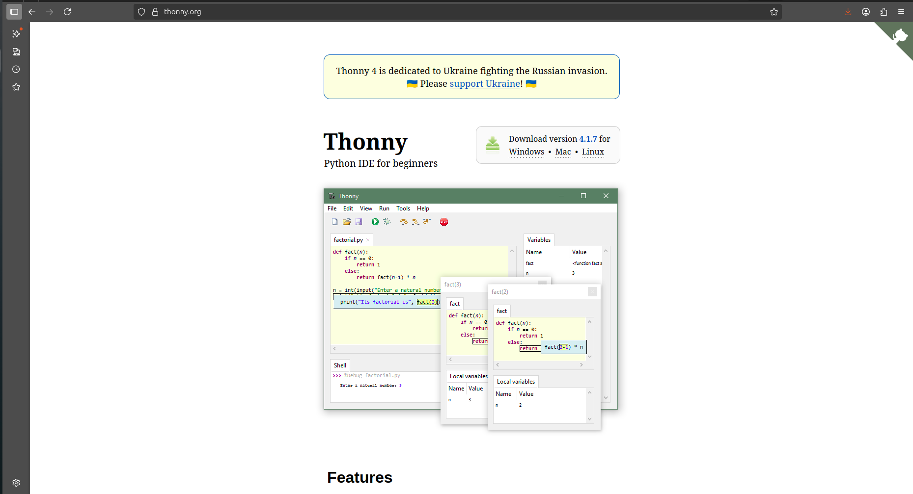

# Setting Up the tools for Shrike

The shrike  features Reneasas Forge FPGA SLG47910 1120 Luts FPGA and RP2040/RP2350 microcontroller from Raspberry Pi.

 To work with Shrike you will need these 2 software.

   1. Go Configure Software Hub (For Fpga Development)
   2. Thonny IDE (For RP2040/2350).

We will install these software on you host machine (computer) one by one.

### 1. Setting Up the Go Configure Software Hub 

Go configure software hub is a free to use tool from renesas however you would need to create a account and login on there website .

Follow these step to get the software.

 1. Open the Go Configure Software Hub page on browser of you choice. The page is linked [here](https://www.renesas.com/en/software-tool/go-configure-software-hub).
   If this link is not working then google search the keywords " renesas go configure hub " and open the first link. You should land here. 

    

    
     
    
    

 2. Navigate on the page and click on the link respective to your operating software. 
   
     

    
     
    
    

 3. Now it will be asked for you to login or Register. We will have to Register click on the Register button.

    

    
     
    
    

 4. Fill all the details here and there would be a email verification and after that your account is good to go.

    

    
     
    
    

 5. Now to this the software page again and click the software link however this time login in with the generated credentials and you the software should start getting downloading if not click on the link onces again. 

 6. Now install the software on my computer.

Congratulations you are one step near to FPGA Development. 

### 2. Setting up Thonny IDE 

To work with RP2040/RP2350 side we will need thonny IDE it's officially recommended by the Raspberry pi. 

Follow these steps get Thonny on you computer. 

 1. Visit the offical website linked [here](https://thonny.org/) or just search "thonny" and open first link on search engine. 

    

    
     
    
    

 2. Download the thonny for your OS. 

Note : if you are on Debian, Raspbian, Ubuntu, Mint just Run `sudo apt install thonny` and you will be good to go. 

Congratulations you now have all the tools that you require for developing with shrike. Lets move ahead and Generate Your first Bitstream check this guide [here](./generating_your_first_bitstream.md) .