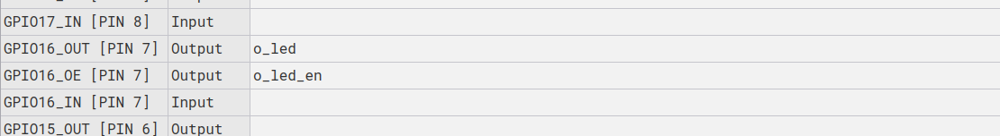
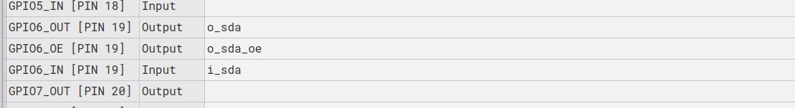
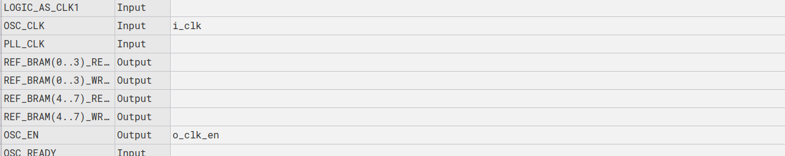

(verilog_style_guide)=

# Verilog Style Guide for Shrike 

The renesas go configure software is a little  different from the vivado or Quartus Prime if you have used them before you will have to take care of these few things while design verilog for the same. Just read the log below to know about it.  


## Synthesis attributes 
Yosys used for synthesizing verilog for renesas forge fpga requires a few synthesis attributes to properly synthesis the design.
These attribute's are related to module hierarchy input output ports and clk;

The main attributes are 

 1. (* top *) -- This is identifier for top module synthesizer will consider this modules as top module. 

 2. (* iopad_external_pin, clkbuf_inhibit *) -- This should be used for hte clk signal so that the yosys creates a clk buffer for this signals path. Use this in only top module. 

 3. (* iopad_external_pin *) -- This needs to be used for every signal that needs to be mapped to the gpio. This the yosys will know not ot optimize it ot change its name. Only used this for top level io's not in every module.

 A example of all of these used in  a i2c example top  

 ```
(* top *) module  i2c_blink #( parameter I2C_SLAVE_ADR = 7'h32
		  ) ( 
		(* iopad_external_pin, clkbuf_inhibit *) input i_clk,
		(* iopad_external_pin *) input i_rst,
		(* iopad_external_pin *) input i_scl,
		(* iopad_external_pin *) input i_sda,
		(* iopad_external_pin *) output o_sda,
		(* iopad_external_pin *) output o_led,
		  
		  // ouput enable signal 
		(* iopad_external_pin *) output o_sda_oe,
		(* iopad_external_pin *) output o_clk_en,
		(* iopad_external_pin *) output o_led_en );
 ```


## Output Enable 

The GPIO core of renesas forge fpga requires a select signal for the io mux to select any pin as input or output.
That is every output requires a output enable associated with it and this oe pin should be assigned to 1 whenever we wish to use that pin as output in case of that pin is not bidirectional and will always be one then enable can be permanently assigned as well.



In case of dedicated input signal you don't need enable the io's as they are by default set to input mode.


## INOUT 

The IDE does not directly support use of INOUT signal type like vivado and other software.
So now the question arises how do to create a bidirectional signal.

We will understand that with a example. Lets say you want to assign a signal named sda as bidirectional then we will to make to separate signal in the completer design they could be named anything but for simplicity lets name them 

```
    input i_sda;
    output o_sda;
    output o_sda_oe;
```

and we will need a third select signal for the mux to switch between input or output . So whenever you require the pin to be output the one_oe signal should be driven high and the corresponding output values should be assigned to one_out. And for using it as input the one_oe should be driven to low and the input value can be latched from the one_in.




## clock enable 

The fpga as a internal oscillator connected to the logic fabric and it gives out 50 Mhz clock.

However top module of our design need ot have a clock_enable signal for enabling in general cases this signal will always be one. 
Thus this is just a output signal assigned to one in the top module of the design.




