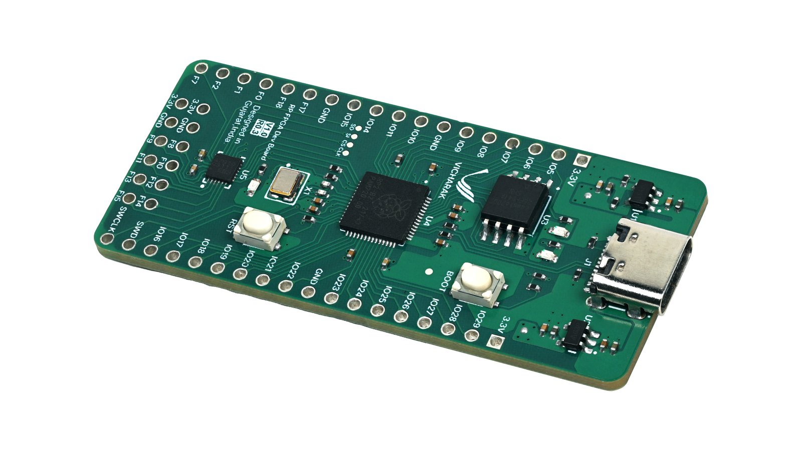

# SHRIKE_FPGA

Shrike is world's first fully open source FPGA Dev board based on Renesas Forge FPGA SLG47910 and RP2040. 

We at vicharak have kept in mind need of a learner, maker and a hobbist while designing this art. This dev board will be your stepping stone in the field of FPGA , reconfigurable and heterogenous computing . 

## [**Now on Crowd Supply**](https://www.crowdsupply.com/vicharak/shrike)!

### Board level Block Diagram
 

### Key Features : 
1.  RP2040 ARM Cortex M0 
2.  FPGA with 1100 Luts
3.  PMOD Compatible Connector
4.  Bread Board compatible Io's from both FPGA and MCU 
5.  High Speed IO interface Between FPGA and MCU
6.  QSPI Flash 
7.  2x User LED's
8.  Type C Port for Power and Programming 

## Resources : 

1. [Getting Started Guide ](./Docs/FPGA_Programming.rst)
2. [Comparitive analysis between cpu and FPGA on Shrike](./Docs/RP2040vsFPGA.md)

## Useful Links : 
1. FPGA Datasheet - [Renesas Forge FPGA ](https://www.renesas.com/en/products/programmable-mixed-signal-asic-ip-products/forgefpga-low-density-fpgas/slg47910-1k-lut-forgefpga)

2. EDA Tool - [Go Configure Software Hub](https://www.renesas.com/en/software-tool/go-configure-software-hub)

3. RP2040 Related Resources- [Getting Started ](https://projects.raspberrypi.org/en/projects/getting-started-with-the-pico)

## 📫 Join our communities at :
  
     &nbsp;   &nbsp;   &nbsp;   &nbsp;   &nbsp;

### Note
 
We are building a ecosystem for learners makers and hobbist around shrike and the projects that will follow in the future thus we request you contribution in the same. Join our communities across all the platforms,pitch and showcase your ideas with Shrike. 

Thank You 
 

## Potential application of Shrike ( Ideas) 
 1. Peripheral Coprocessor 
 2. ROS Node using Micro ROS
 3. Protocol converter (USB to uart ,  Uart-SPI, SPI-I2C etc)

### Demo Projects - TODO ( Your contributions are appreciated )  

1. LED Water                         
2. Servo Controller  
3. I2C to Uart 
4. UART to 7 seg  
5. RISC V SERV 
7. LCD Display 16*2 
8. Periplex (port) 
9. 4 bit 7 segment Controller 
10. SPI Display Driver 
11. 8 Bit protocol for v2 
12. FFT 
13. PWM Coprocessor ( servo and motor controls)
14. Signal Generator  ( Pll for higher frequencies)
15. Random number generator 
16. Counter 4 bit                                       -- DONE

## FPGA Flashing time Analysis 

### FPGA CPU Interconnect Pinouts 

| FPGA PIN | RP 2040 PIN | S_Fun RP2040     | S_Fun FPGA         |
|----------|-------------|------------------|--------------------|
| 0        | 13          | GPIO UART0-RX /SCL   |GPIO                |
| 1        | 12          | GPIO UART0-TX /SDA   | GPIO               |
| 3        | 2           | GPIO             | SPI_SCLK           |
| 4        | 1           | UART RX / GPIO   | SPI_SS             |
| 5        | 3           | GPIO             | SPI_SI (MOSI)      |
| 6        | 0           | UART TX / GPIO   | SPI_SO (MISO) / CONFIG |

 

## Resources 
 #### 1. Learning Resources 

   1. [AISC WORLD Verilog Tutorials ](https://www.asic-world.com/verilog/veritut.html)
   2. [Nandland FPGA Tutorials](https://nandland.com/fpga-101/)
   3. [FPGA for Fun](https://www.fpga4fun.com/)
   4. [Lawrie FPGA Tutorials](https://lawrie.github.io/blackicemxbook/)
  
 #### 2. Similar Hardware Projects 
   1. [Ulx3s-Project](https://ulx3s.github.io/)
   2. [TinyFPGA-Project](https://tinyfpga.com/)
   3. [icebreaker-Project](https://github.com/icebreaker-fpga/icebreaker)
   
